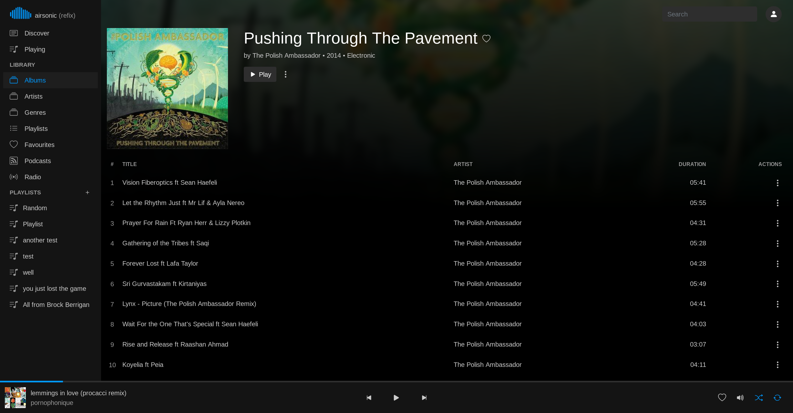
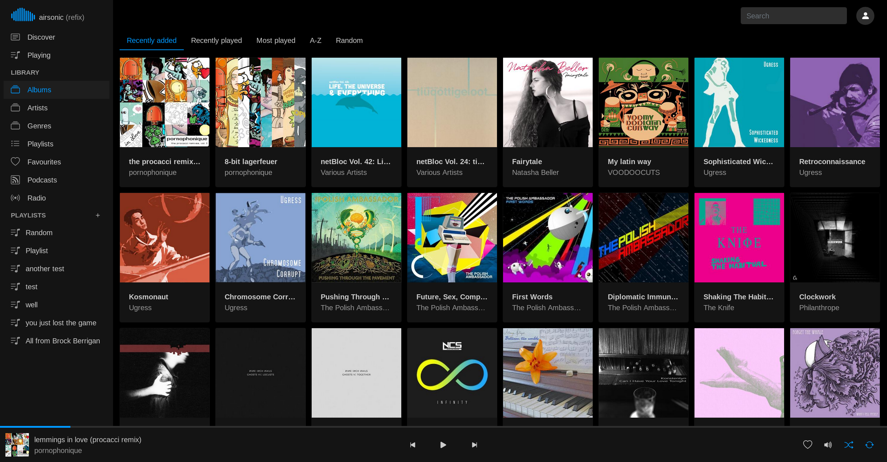
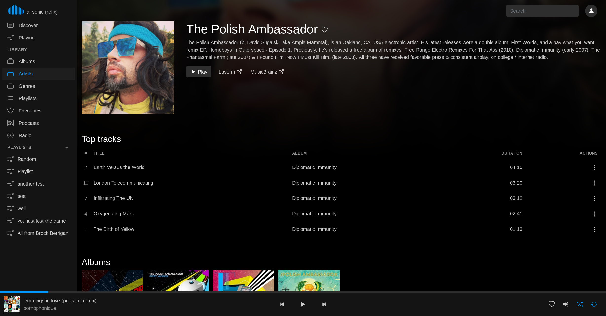
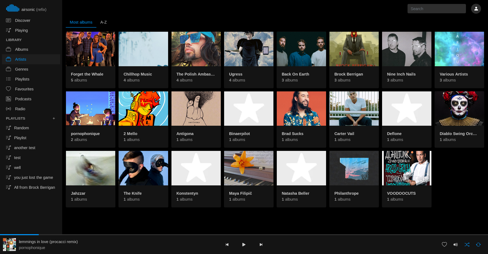

# Xonic UI (fork of [Airsonic-refix](https://github.com/tamland/airsonic-refix))
[](https://app.netlify.com/sites/xonic-ui/deploys)


Modern responsive web frontend for [airsonic-advanced](https://github.com/airsonic-advanced/airsonic-advanced), [navidrome](https://github.com/navidrome/navidrome),
[gonic](https://github.com/sentriz/gonic) and other [subsonic](https://github.com/topics/subsonic) compatible music servers.

## Features
- Responsive UI for desktop and mobile
- Browse library for albums, artist, generes
- Playback with persistent queue, repeat & shuffle
- MediaSession integration
- View, create, and edit playlists with drag and drop
- Built-in 'random' playlist
- Search
- Favourites
- Internet radio
- Podcasts
- Files
- Shares (via [OpenSubsonic API proposal](https://github.com/opensubsonic/open-subsonic-api/discussions/47), )
- Themes
- Client Settings
- Collection Downloads (build zip archive in your browser)
- New version check (in about)

## [Live demo](https://xonic-ui.netlify.com) 

You can try it here: https://xonic-ui.netlify.com

Enter the URL and credentials for your subsonic compatible server, or use one of the following public demo servers:

**Subsonic**  
  Server: `https://airsonic.netlify.app/api`  
  Username: `guest4`, `guest5`, `guest6`, etc.  
  Password: `guest`

**Navidrome**  
  Server: `https://demo.navidrome.org`  
  Username: `demo`  
  Password: `demo`


**Note**: if the server is using http only you must allow mixed content in your browser otherwise login will not work.

## Screenshots









## Install

### Docker

```
$ docker run -d -p 8080:80 archekb/xonic-ui:latest
```

You can now access the application at http://localhost:8080/

Environment variables:
- `XONIC_SERVER_URL` (Optional): The backend server URL. When set the server input on the login page will not be displayed.
- `XONIC_SETTINGS` (Optional): Client configuration.


### Build from source

```
$ yarn install
$ yarn build
```

Bundle can be found in the `dist` folder.

### Build docker image:

```
$ docker build -t xonic-ui:latest -f docker/Dockerfile .
```

## Develop

```
$ yarn install
$ yarn serve
```


## License

Licensed under the [AGPLv3](LICENSE) license.
